### Nathan Guilhot (aka NIGHTEͶ)

Hi there! I'm running things on the web since I'm old enough to buy a domain name, and I now solve business problem with code for a living.

Public Projects:
- [Glit ·.° simple git worktree manager](https://github.com/NathanGuilhot/glit)

I'm also a digital illustrator!

[Personal Website (since 2017)](https://nighten.fr)

Fediverse/Mastodon : [NIGHTEN@hi.nighten.fr](https://hi.nighten.fr/NIGHTEN)

[**EMAIL**](mailto:nathan.guilhot@gmx.fr)

<!--
**NightenDushi/NightenDushi** is a ✨ _special_ ✨ repository because its `README.md` (this file) appears on your GitHub profile.

Here are some ideas to get you started:

- 🔭 I’m currently working on ...
- 🌱 I’m currently learning ...
- 👯 I’m looking to collaborate on ...
- 🤔 I’m looking for help with ...
- 💬 Ask me about ...
- 📫 How to reach me: ...
- 😄 Pronouns: ...
- ⚡ Fun fact: ...
-->
